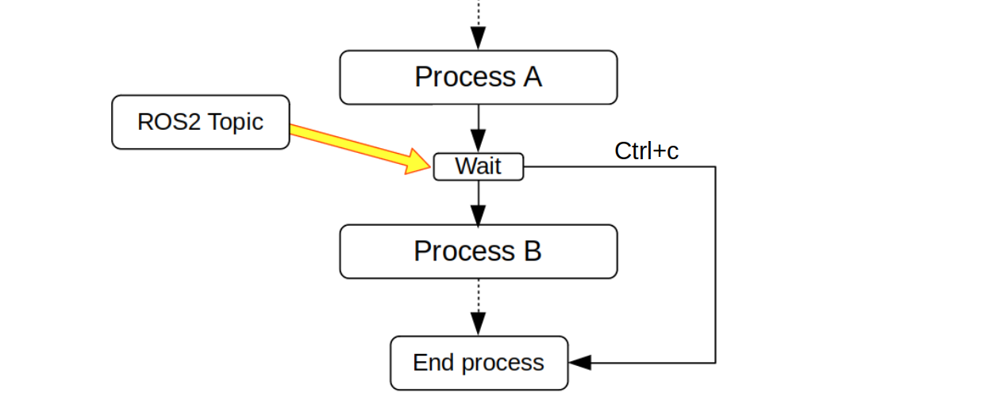

# rclcpp-trigger-example

Setting wait points for example program by ROS2.



> **Warning**
>
> It is not recommended to use rclcpp without inheritance

<br>

## Run example

```bash
# Download and compile
git clone https://github.com/Ar-Ray-code/rclcpp-trigger-example.git
cd rclcpp-trigger-example/
colcon build

# run
./install/rclcpp_trigger/lib/rclcpp_trigger/trigger_example
```

### Send Trigger
```bash
ros2 topic pub --once /signal1 std_msgs/msg/Empty {}
ros2 topic pub --once /signal2 std_msgs/msg/Empty {}
```

<br>

## Example program

See [trigger_example.cpp](./src/trigger_example.cpp) .

```C++
#include "rclcpp_trigger/trigger.hpp"

int main(void)
{
    // ROS2 init
    rclcpp::init(0, nullptr);
    rclcpp::Node::SharedPtr node = rclcpp::Node::make_shared("trigger_example");

    // Define trigger2
    Trigger trigger2(node, "signal2");

    // Set trigger1 and wait. (Setting subscription "/signal1" and spin_some)
    Trigger trigger1(node, "signal1", 10, true);
    // Execute after receiving "signal1"
    std::cout << "Step1" << std::endl;

    // wait by trigger2 (Setting subscription "/signal2" and spin_some)
    trigger2.wait_until_callback();
    // Execute after receiving "/signal2"
    std::cout << "Step2" << std::endl;

    rclcpp::shutdown();
    return 0;
}
```